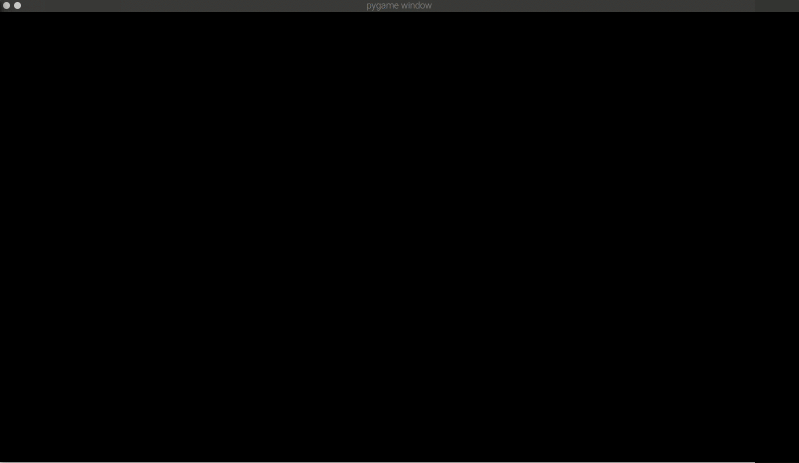

# Maze Generator Part 2
A maze generator. In this part, we build the forward tracking part of the algorithm. This is the 2nd part of the tenth challenge in [The Coding Train's](https://www.youtube.com/channel/UCvjgXvBlbQiydffZU7m1_aw) [Coding Challenges](https://thecodingtrain.com/CodingChallenges/).

## Demo:

[Link to challenge](https://thecodingtrain.com/CodingChallenges/010.2-maze-dfs-p5.html)

This code was contributed by Soumitra Shewale ([@soumitradev](https://github.com/soumitradev))

## License
[MIT License](../LICENSE)
