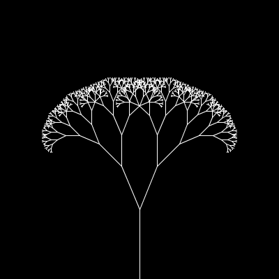

# Fractal Tree - Recursive
This is the recursive implementation of fractal tree. It needed the `push()` and `pop()` functions from the Processing library, so this is a Processing.py implementation as opposed to the usual pygame implementation. This is the 14th challenge in [The Coding Train's](https://www.youtube.com/channel/UCvjgXvBlbQiydffZU7m1_aw) [Coding Challenges](https://thecodingtrain.com/CodingChallenges/).

## Demo:

[Link to challenge](https://thecodingtrain.com/CodingChallenges/014-fractaltree.html)

This code was contributed by Soumitra Shewale ([@soumitradev](https://github.com/soumitradev))

## License
[MIT License](../LICENSE)
