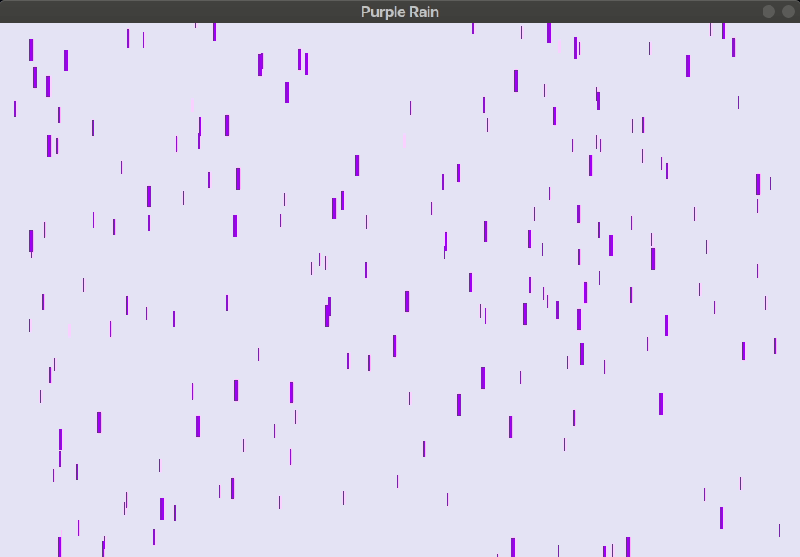

# [Purple Rain](https://www.youtube.com/watch?v=TvnYmWpD_T8)

Purple rain simulator written in pygame.

This is the fourth challenge in [The Coding Train's](https://www.youtube.com/channel/UCvjgXvBlbQiydffZU7m1_aw) [Coding Challenges](https://thecodingtrain.com/CodingChallenges/).

[Link to challenge](https://thecodingtrain.com/CodingChallenges/004-purplerain.html)

This code was contributed by Madhav Sharma ([@pseudocodenerd](https://github.com/pseudocodenerd))

## Demo

## License
[MIT License](../LICENSE)
