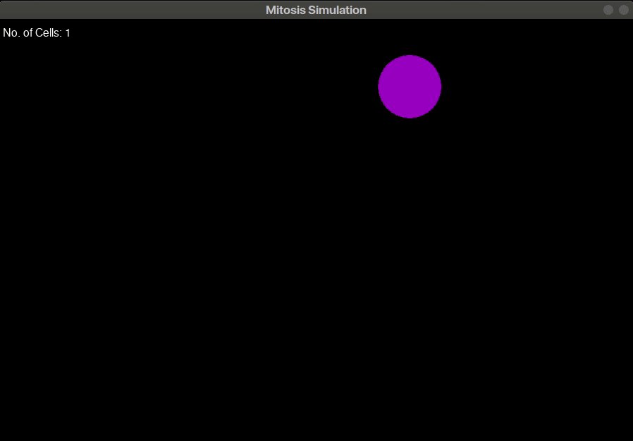

# Solar System 2D
A simulation of cell reproduction via Mitosis in pygame. This is the seventh challenge in [The Coding Train's](https://www.youtube.com/channel/UCvjgXvBlbQiydffZU7m1_aw) [Coding Challenges](https://thecodingtrain.com/CodingChallenges/).

## Demo:

[Link to challenge](https://thecodingtrain.com/CodingChallenges/006-mitosis-p5.html)

This code was contributed by Madhav Sharma ([@pseudocodenerd](https://github.com/pseudocodenerd))

## License
[MIT License](../LICENSE)
