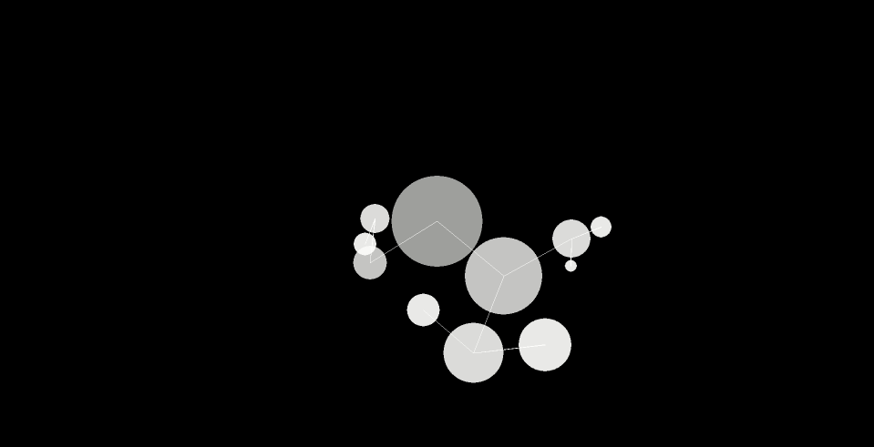

# Solar System 2D
A *very* inaccurate 2D Solar System simulation. This is the seventh challenge in [The Coding Train's](https://www.youtube.com/channel/UCvjgXvBlbQiydffZU7m1_aw) [Coding Challenges](https://thecodingtrain.com/CodingChallenges/).

## Demo:

[Link to challenge](https://thecodingtrain.com/CodingChallenges/007-solarsystemgenerator.html)

This code was contributed by Soumitra Shewale ([@soumitradev](https://github.com/soumitradev))

## License
[MIT License](../LICENSE)
